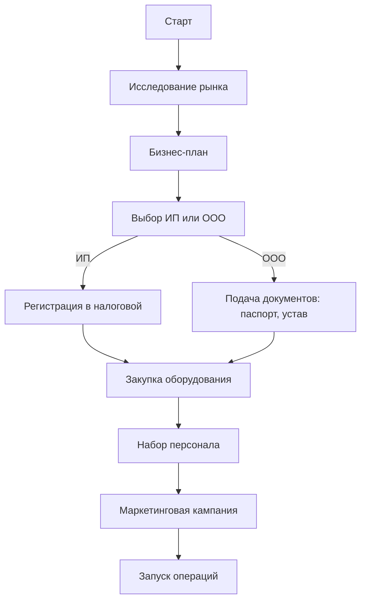

**Уточнение проблемы:**  
Пользователь хочет открыть клининговый бизнес в Беларуси, ориентированный на B2C (частные клиенты, например, квартиры, дома) или B2B (коммерческие клиенты, например, офисы, медицинские учреждения). Неясности: целевой рынок, масштаб, бюджет, местоположение. Предположения: пользователь — начинающий предприниматель с ограниченным капиталом, цель — масштабируемый бизнес с минимальными юридическими сложностями.

**Декомпозиция причин:**  
Метод 5-Why:  
1. Почему начинать клининговый бизнес? Высокий спрос на профессиональную уборку в Беларуси из-за нехватки времени у людей и тенденции аутсорсинга у бизнеса.  
2. Почему спрос высок? Растущий средний класс и компании предпочитают профессиональные услуги.  
3. Почему выбирают профессионалов? Качество, эффективность, специализированное оборудование экономят время и обеспечивают соответствие стандартам.  
4. Почему это жизнеспособно в Беларуси? Низкая насыщенность рынка в B2C, умеренная конкуренция в B2B, простое регулирование.  
5. Почему сейчас? Экономическое восстановление после кризиса и рост аутсорсинга создают благоприятные условия.  
Ключевые переменные: сегмент рынка (B2C/B2B), конкуренция, начальные вложения, соблюдение законодательства, привлечение клиентов.

**Сегментация задач:**  
1. **Исследование рынка (высокий приоритет):** Анализ спроса, конкурентов, цен.  
2. **Бизнес-план (высокий приоритет):** Разработка плана с финансовыми прогнозами.  
3. **Юридическая регистрация (высокий приоритет):** Выбор и регистрация ИП или ООО.  
4. **Закупка оборудования (средний приоритет):** Приобретение инструментов и химии.  
5. **Набор персонала (средний приоритет):** Найм и обучение уборщиков.  
6. **Маркетинговая стратегия (высокий приоритет):** План привлечения клиентов онлайн/оффлайн.  
7. **Настройка операций (средний приоритет):** Организация хранения и логистики.

**Многопутевой дизайн решений:**  
1. **ИП с фокусом на B2C:**  
   - **Плюсы:** Низкий порог входа, минимальные вложения (~$2,000-$3,000), упрощённая налоговая система (6% от выручки). Фокус на уборке жилых помещений.  
   - **Минусы:** Ограниченная масштабируемость, высокая личная ответственность, сложно получить крупных клиентов.  
   - **Риски:** Сезонные колебания спроса (например, спад в январе), проблемы с удержанием клиентов.  
2. **ООО с фокусом на B2B:**  
   - **Плюсы:** Доступ к коммерческим клиентам (офисы, медучреждения), высокий потенциал дохода, ограниченная ответственность.  
   - **Минусы:** Высокие начальные затраты (~$5,000-$10,000), сложная регистрация, строгие требования (например, для медучреждений).  
   - **Риски:** Налоговые проверки, высокая конкуренция.  
3. **Гибридная модель с франшизой:**  
   - **Плюсы:** Использование известного бренда, снижение затрат на маркетинг, операционная поддержка.  
   - **Минусы:** Плата за франшизу (20% с заказа), меньшая автономия, вложения (~$3,000-$5,000).  
   - **Риски:** Зависимость от репутации франчайзера, низкая маржа.

**Визуальные рабочие процессы:**  

```

**Требования к инструментам и навыкам:**  
- **Инструменты:** Профессиональное оборудование (пылесос, пароочиститель, швабры), химия, CRM для управления клиентами.  
- **Навыки:** Основы управления бизнесом, техники уборки, маркетинг (соцсети, локальная реклама), обучение персонала.  
- **Экспертиза:** Юридическая консультация для регистрации ООО, бухгалтер для налогов.

**Оценка времени и ресурсов:**  
- **Исследование рынка:** 2-3 недели, минимальные затраты (бесплатные ресурсы, ~$50 на платные данные).  
- **Бизнес-план:** 1-2 недели, ~$100 при аутсорсе.  
- **Регистрация:** 1-2 дня для ИП ($50-$100), 1-2 недели для ООО ($200-$300, включая госпошлину $50).  
- **Оборудование:** 1 неделя, $1,000-$3,000 (базовый набор).  
- **Персонал:** 2-4 недели, $500-$1,000 на обучение.  
- **Маркетинг:** Постоянно, $200-$500/месяц (соцсети, листовки).  
- **Узкие места:** Задержки с привлечением клиентов, текучка кадров, соблюдение требований для B2B.

**Рекомендация лучшего пути:**  
ИП с фокусом на B2C рекомендован для начинающего предпринимателя в Беларуси из-за низких затрат, простоты регистрации и растущего спроса на уборку жилых помещений. Масштабирование возможно позже через переход к ООО для B2B. Обоснование: минимизация рисков, соответствие рыночным трендам, упрощённая налоговая система.

**Рефлексия и крайние случаи:**  
- **Слепые зоны:** Недооценка сезонных спадов, игнорирование цен конкурентов, недостаток обучения персонала.  
- **Этические аспекты:** Справедливая зарплата уборщикам, использование экологичной химии для безопасности.  
- **Крайние случаи:** Повреждение имущества (нужна страховка), высокая текучка кадров, изменения в налоговом законодательстве.

**План выполнения:**  

1. Провести исследование рынка: Анализ конкурентов, цен, спроса в целевом городе (2-3 недели).  
2. Составить бизнес-план: Услуги, цены, финансовые прогнозы (1-2 недели).  
3. Зарегистрировать ИП: Паспорт, ИНН, госпошлина $50 (1-2 дня).  
4. Открыть банковский счёт: Для платежей и налогов (1 день).  
5. Закупить оборудование: Пылесос, швабры, экологичная химия ($1,000-$2,000).  
6. Нанять 2-3 уборщиков: Обучить техникам уборки (2-3 недели).  
7. Запустить маркетинг: Реклама в соцсетях, листовки ($200/месяц).  
8. Начать операции: Приём первых клиентов, контроль качества (постоянно).  
9. Мониторинг и адаптация: Корректировка цен/услуг по отзывам (ежемесячно).  
